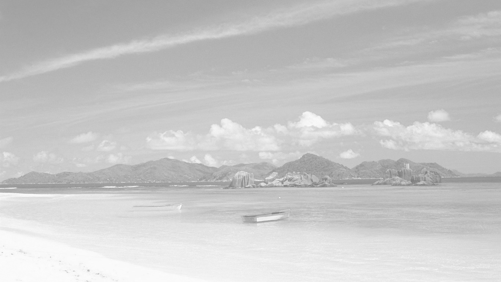

# Mirage Tank

Mirage Tank is a image generator that can generate a special image called
"Mirage Tank" from two given images. This program is fully based on QT, so it's
cross-platform and system-independent.

---

## About "Mirage Tank"

The "Mirage Tank" refers to a kind of pictures that seem completely different
depending on the background color.

For example, look at this picture:

If your github page has a white background color, you might have seen the coast. But when you open this file in a new tab (or any other page/software that has a black background), you can then see a sci-fi city.

## Build

1. Open the `.pro` file in QT Creater, and compile it
2. Enjoy!

## Software Usage Guide

1. Choose two pictures, one displayed when background is white, another black
2. Press `Generate` button
3. (optional) Click the generated image to toggle background color between white and black
4. Press `Save` button to save the output file
